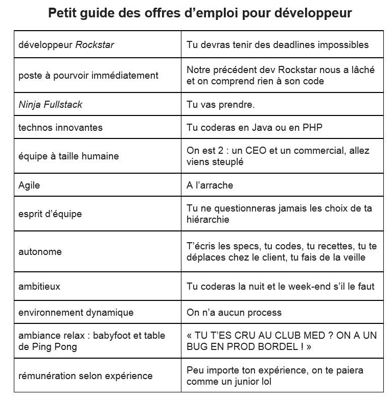

## Trouver la bonne boîte

Pas facile parfois de trouver une boîte qui a du sens, qui œuvre pour un meilleur futur...

Peut-être que vous ne serez pas aligné avec toutes les boites et activités listé dans ce document, mais ça à le mérite d'exister :slight_smile:

https://docs.google.com/spreadsheets/d/1R3YQt7bForknymB49o_sFSf7rSRQqRHEzKbp8NlOgrk/edit#gid=1484907364

Bonne lecture et bonne recherche !

## Questions posées lors d’entretiens techniques

Hello le Rookie Club,

Cet été j’ai passé plusieurs entretiens techniques pour trouver mon premier poste de développeur. Je ne savais pas trop à quoi m’attendre et j’ai été assez surpris de découvrir différentes façons de faire d’une boîte à l’autre.
J’ai noté toutes les questions qu’on m’a posé, pour y répondre plus tard, et puis je me suis dit que ça pourrait être utile à ceux qui préparent leurs premiers entretiens. Je vous fais un petit bilan :

### 1er entretien (par Skype) pour un poste de dev full-stack Ruby on Rails junior

Ils ont commencé par des questions puis m’ont demandé de coder dans un Repl.

Que fait la fonction map en Ruby ?
Peux tu écrire quelque lignes de code avec la fonction map ?
Peux tu recoder la fonction map ?
A quoi sert le includes en ruby ?
Et le extend ?
Comment appeler une méthode privée d'une classe sans avoir à modifier la classe ?
Quels sont les verbes de requêtes http ?
Que sais-tu sur la mise en cache ?
Que sais tu des notions de complexité et d'algorithmie ?

Pour finir, j’ai fait un kata en TDD. Il fallait coder une fonction qui détermine si une string passée en paramètre est un pangramme ou pas. Un pangramme est une phrase qui contient toutes les lettres de l’alphabet. Ex : « Portez ce vieux whisky au juge blond qui fume » .

Ça s’est plutôt bien passé et j’ai été très agréablement surpris d’avoir appris beaucoup de choses au cours de l’entretien.

### 2e entretien (sur place) aussi pour un poste de dev full-stack Ruby on Rails junior

L’entretien technique était une sorte de quiz de culture générale sur différents domaines de l’informatique, le tout se déroulant plutôt sous la forme d’une conversation. Ils n’attendaient pas de moi que je puisse répondre à tout, mais évaluaient comment je pouvais faire des suppositions ou improviser quand je ne savais pas. Le format était plutôt sympa et là aussi j’ai appris pas mal de choses.

Qu’est-ce qu’un système d’exploitation ?
Un kernel ?
SysCall ?
Un système de fichiers ?
La programmation concourante ?
Un fork ? Un thread ?
Une machine virtuelle ?
Que veut dire OSI ?
TCP/IP ?
UDP
VPN
DHCP
SSH
Qu’est-ce qu’une exception ?
Le terme stack ?
Empiler, dépiler ?
Le tas ?
Garbage collector ?
Quelle est la différence entre la sortie d’un compilateur en C et en Java ?
Quels sont les 3 types de langages ?
Dans une base de données, que fait un join ?
Une transaction ?
Différences entre SQL et Postgresql ?
NoSql ?
Reddis ? MongoDB ?
En Ruby, que signifie irb ?
Rack ? Et Rake ?
Qu’est-ce qu’un helper ?
Comment tester un controller ?
Les requetes http ?
Les fqmilles de code de retours ?
Un cookie ?
Cookie forgery ?
Comment faire du caching avec Ruby On Rails ?

### Un 3e entretien sur place pour un poste d’artisan logiciel dans une start-up faisant des logiciels en Ada

Je dois faire un kata en TDD en Java. Il s’agit de coder une fonction prenant en paramètre une string contenant 0, 1 ou 2 chiffres et qui renvoie un entier correspondant à la somme de ces chiffres.

Les consignes : respecter le cycle red, green, refactor. Un test ne doit faire qu’une chose. Il faut écrire juste le code suffisant pour faire passer le test, puis refactorer.

En cours de kata, on me demande de me focaliser sur 3 aspects : le nommage métier (domain driven design), faire une chose à la fois (single responsability principle) et le single level of abstraction.

J’étais content, j’avais découvert toutes ces notions au Rookie Club, mais ça s’est plutôt mal passé. Ils avaient une vision très rigide de la façon de faire et me reprenait au moindre écart. Pas très agréable.

### Un 4e entretien sur place pour un poste de dev Ruby On Rails

Quelques jours avant l’entretien, ils me demandent de choisir un bout de code à moi pour leur présenter : une fonctionnalité que j’ai aimé mettre en place, du code dont je suis fier, ou au contraire que je voudrais améliorer.
C’est un format que j’ai trouvé très intéressant mais c’était peut-être le plus difficile. J’ai choisi une fonctionnalité que je trouvais assez complexe sur laquelle j’avais travaillé les jours précédents au cours de mon stage. J’ai essayé de préparer mes explications et d’anticiper les questions qu’ils allaient me poser. Et sur le moment de trouver un équilibre entre la précision technique et la clarté des explications. Au final, c’était un échange enrichissant. C’était intéressant de voir sur quelles parties du code présentées ils réagissaient et quels avis ils pouvaient avoir sur les choix effectués.

## Les sites pour trouver un boulot ou un stage

Les sites

* https://emploi.alsacreations.com/
* https://www.chooseyourboss.com/
* https://www.welcometothejungle.co/
* https://remixjobs.com/

Les cabinets de recrutement

* https://www.urbanlinker.com/
* https://www.talent.io/
* https://www.bessand-recrutement.com/

## Décryptage des offres d'emploi

Un petit tableau explicatif pour mieux comprendre certaines offres d'emploi.

